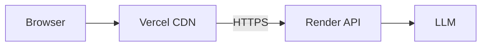

# Spotify Moment — MVP Architecture

> **Goal:** Showcase all three solutions from the problem statement in a believable demo — not build production Spotify.  
> **Build order:** Backend logic first → Frontend UI last (polish the story).  
> **Time:** ~4–6 hrs for full showcase · ~2–3 hrs for core demo (Phase 1 + minimal UI).

**Source:** [ProblemStatment.md](./ProblemStatment.md)

---

## What reviewers must see

The MVP is a **story demo**. Every feature from the brief maps to something visible on screen:

| Solution | Reviewer sees |
|----------|----------------|
| **1 — Context Engine** | Context card updates · list re-sorts · "AI is analysing…" · reason under each track |
| **1 — Conversational refine** | "Refine Session" input · *"Applied to this session only"* banner |
| **2 — Discovery Slots** | Every 4th track labelled · exploration meter moves · toast feedback |
| **3 — Repetition Fatigue** | Same artist tracked · insight banner · adjacent-artist swap · Familiar ↔ Discovery bar |

If a feature isn't visible in the UI, it doesn't count for the MVP.

---

## System overview

```mermaid
flowchart TB
    subgraph Frontend["Frontend — Phase 4"]
        Home[Home Screen]
        Player[Player Screen]
        UI[Indicators + Toasts + Overlays]
    end

    subgraph Backend["Backend — Phases 1–3"]
        API[Express API]
        Engine[sessionEngine.ts]
        LLM[/api/analyze → LLM]
    end

    subgraph Data
        JSON[(tracks.json + taste.json)]
    end

    Home --> API
    Player --> API
    API --> Engine
    Engine --> JSON
    Engine --> LLM
    LLM --> Engine
    API --> Frontend
```

**Small backend is worth it** — keeps LLM key safe, one place for all session logic, frontend stays thin (fetch + render).

---

## Tech stack

| Layer | Choice |
|-------|--------|
| Frontend | Vite + React + TypeScript + Tailwind |
| Backend | Express (or Fastify) — ~4 routes |
| State | Backend holds session; frontend mirrors via API responses |
| LLM | OpenAI `gpt-4o-mini` / Gemini Flash / Claude Haiku |
| Data | Static JSON (~25 tracks, 5–8 artists with repeats for fatigue demo) |

Skip for MVP: Spotify API, auth, database, tests.  
**Deploy (Phases 5–6):** Backend on Render, frontend on Vercel — see [implementation.md](./implementation.md#9-phase-5--deploy-backend-on-render).

---

## UI design system (Figma reference)

All Phase 4 UI must follow the **[Spotify UI — Free UI Kit (Recreated)](https://www.figma.com/design/bbDRzBTD2MF2bqD1xfOg5Q/Spotify-UI---Free-UI-Kit--Recreated---Community-)** community kit. Use the same colours, surfaces, typography hierarchy, and layout patterns — adapted for the Spotify Moment demo (not a full app clone).

### Figma frames → MVP screens

| Figma frame | Link | Maps to in Spotify Moment |
|-------------|------|---------------------------|
| **Home / Browse** | [node 0-30](https://www.figma.com/design/bbDRzBTD2MF2bqD1xfOg5Q/Spotify-UI---Free-UI-Kit--Recreated---Community-?node-id=0-30) | Main shell: dark canvas, content area, section headings |
| **Sidebar / Nav** | [node 0-372](https://www.figma.com/design/bbDRzBTD2MF2bqD1xfOg5Q/Spotify-UI---Free-UI-Kit--Recreated---Community-?node-id=0-372) | Left panel: Context card, meters, Refine Session |
| **Now Playing / Player** | [node 0-1056](https://www.figma.com/design/bbDRzBTD2MF2bqD1xfOg5Q/Spotify-UI---Free-UI-Kit--Recreated---Community-?node-id=0-1056) | Player bar: album art placeholder, track meta, controls, progress |
| **Queue / Track list** | [node 0-1545](https://www.figma.com/design/bbDRzBTD2MF2bqD1xfOg5Q/Spotify-UI---Free-UI-Kit--Recreated---Community-?node-id=0-1545) | "For You" list: row layout, metadata, hover states |

### Colour tokens

Use CSS variables — match the kit’s dark theme exactly:

```css
:root {
  /* Surfaces (darkest → elevated) */
  --spotify-black: #000000;       /* sidebar / deepest chrome */
  --spotify-bg: #121212;          /* main app background */
  --spotify-surface: #181818;     /* cards, panels */
  --spotify-surface-mid: #1f1f1f; /* interactive fills, inputs */
  --spotify-panel: #282828;       /* hover rows, menus, player chrome */
  --spotify-border: #333333;      /* dividers, progress track */

  /* Brand & actions */
  --spotify-green: #1ed760;       /* primary accent — play, active, CTAs */
  --spotify-green-hover: #1abc54;
  --spotify-green-legacy: #1db954; /* badges, older kit accents */
  --spotify-green-muted: rgba(29, 185, 84, 0.2); /* discovery pill bg */

  /* Text */
  --text-base: #ffffff;           /* titles, primary labels */
  --text-subdued: #b3b3b3;        /* artists, secondary copy */
  --text-muted: #a7a7a7;          /* metadata, timestamps */
  --text-disabled: #535353;       /* placeholders, inactive icons */

  /* Semantic (Moment-specific overlays) */
  --accent-insight: #fcd34d;      /* fatigue insight banner text */
  --accent-insight-bg: rgba(245, 158, 11, 0.12);
  --accent-insight-border: rgba(245, 158, 11, 0.35);
  --accent-swap: #f59e0b;         /* fatigue swap row highlight */
  --danger: #e91429;              /* errors */
}
```

**Rule:** Green is **functional only** — play buttons, active nav, primary CTAs, discovery badges. Never use green for large background fills.

### Typography

Kit uses **Circular** / SpotifyMixUI. For MVP use system stack:

```css
font-family: "Circular", "Helvetica Neue", Helvetica, Arial, sans-serif;
/* fallback: system-ui, -apple-system, sans-serif */
```

| Role | Size | Weight | Colour | Use |
|------|------|--------|--------|-----|
| Section title | 24px | 700 | `--text-base` | "For You", "Good afternoon" |
| Card title | 20px | 700 | `--text-base` | Context label |
| Track title | 16px | 400 | `--text-base` | List row title |
| Body / artist | 14px | 400 | `--text-subdued` | Artist name, reasons |
| Caption / label | 11–12px | 400 | `--text-muted` | "CURRENT CONTEXT", uppercase labels |
| Badge | 11px | 500 | `--spotify-green-legacy` | Discovery Track pill |

### Spacing & shape (8px grid)

| Token | Value | Use |
|-------|-------|-----|
| `--radius-sm` | 4px | progress bars |
| `--radius-md` | 8px | cards, inputs |
| `--radius-lg` | 12px | modals, overlay |
| `--radius-pill` | 500px | buttons, badges, search |
| `--space-1` | 8px | tight gaps |
| `--space-2` | 16px | card padding |
| `--space-3` | 24px | section gaps |
| `--space-4` | 32px | layout margins |

### Layout shell (from kit)

```
┌──────────┬────────────────────────────────────────────┐
│ SIDEBAR  │  MAIN (#121212)                            │
│ #000000  │  ┌─ Context card (#181818) ─────────┐   │
│ 240px    │  │ Meters · Refine · Insight          │   │
│          │  └────────────────────────────────────┘   │
│          │  ┌─ Player (#181818) ─────────────────┐   │
│          │  │ art · title · progress · controls    │   │
│          │  └────────────────────────────────────┘   │
│          │  For You · updates live                    │
│          │  ┌ track rows (#181818 hover #282828) ──┐  │
│          │  └──────────────────────────────────────┘  │
└──────────┴────────────────────────────────────────────┘
```

Row hover: `#282828`. Active/playing row: left border `--spotify-green`.

---

## Core API (backend)

All logic lives server-side. Frontend only sends actions and renders the response.

| Method | Route | Body | Returns |
|--------|-------|------|---------|
| `POST` | `/api/session/start` | `{ deviceType? }` | Full session state + initial queue |
| `POST` | `/api/session/signal` | `{ type, trackId?, skipAtSec? }` | Updated state (context, queue, toasts) |
| `POST` | `/api/session/refine` | `{ text }` | Updated state + session-only message |
| `GET` | `/api/session` | — | Current state (optional refresh) |

Internal: `POST /api/analyze` called by engine (not exposed to browser).

### Response shape (frontend consumes this)

```typescript
type SessionResponse = {
  contextLabel: string;           // "Morning Commute" → "High Energy Commute"
  contextConfidence: number;      // 0–100
  explorationLevel: number;       // 0–1  (Solution 2)
  familiarityScore: number;       // 0–1  (Solution 3 — inverse of discovery appetite)
  recommendations: {
    id: string;
    title: string;
    artist: string;
    albumArt?: string;
    isDiscovery: boolean;
    isSwap: boolean;              // fatigue swap flag
    reason: string;               // LLM or fallback
  }[];
  nowPlaying: { trackId: string; progress: number } | null;
  artistPlayCounts: Record<string, number>;
  toast?: string;                 // "Exploration Increased" | "Returning to familiar music"
  insightBanner?: string;         // fatigue insight
  sessionMessage?: string;        // "Applied to this session only"
  isAnalyzing: boolean;           // true while LLM in flight
};
```

---

## Mock data (design for the demo)

Curate `tracks.json` so all three solutions are easy to trigger:

```typescript
// Each track needs:
{ id, title, artist, energy: 1-5, genres: [], isMainstream: bool, isDiscoveryCandidate: bool }
```

| Demo need | Data trick |
|-----------|------------|
| Context shift on skip | Mix low-energy (energy 1–2) and high-energy (4–5) tracks |
| Discovery slots | 6–8 tracks with `isDiscoveryCandidate: true`, adjacent genres |
| Fatigue | 3+ tracks by **Taylor Swift** (or one artist) + 2 **adjacent** artists same genre |
| Refine "not EDM" | Tag some tracks `genres: ["EDM"]` |
| Long-term taste | `taste.json` — preferred genres never change; only session re-ranks |

---

## LLM integration (used by Phase 1 engine)

**Hybrid:** rules re-sort instantly → LLM enriches label + reasons (~1s debounce).

### When to call

| Trigger | LLM output |
|---------|------------|
| Debounced after skip/like/save/replay | `contextLabel`, `explanations` per track |
| Refine submit | `sessionConstraints` + `sessionMessage` |
| Fatigue swap | `insightBanner` copy |

### LLM request (compact)

```typescript
{
  recentSignals: ["SKIP@8s low-energy", "LIKE indie-pop"],
  timeOfDay: "morning",
  explorationLevel: 0.6,
  artistPlayCounts: { "Taylor Swift": 3 },
  refineText?: "something upbeat but not EDM",
  tracks: [{ id, title, artist, energy, genres, isDiscovery }]  // top 10 only
}
```

### LLM response (JSON only)

```typescript
{
  contextLabel: string;
  contextConfidence: number;
  sessionConstraints?: { minEnergy?, excludeGenres?, lessMainstream?, preferFemaleArtists? };
  explanations: Record<trackId, string>;
  insightBanner?: string;
  sessionMessage?: string;
}
```

**Fallback:** keyword refine + template reasons if LLM fails or no API key.

**System prompt guardrail:** *Session only. Never modify long-term taste.*

---

## Phase 1 — Real-Time Context Engine (backend) · ~60–90 min

**Solution 1** — passive context + optional refine.

### `sessionEngine.ts` rules (instant)

| Signal | Rule effect |
|--------|-------------|
| App start | Label from hour + device → "Morning Commute" |
| Skip @ <15s | Boost high-energy tracks |
| Skip @ >50% | Boost lower-energy |
| Like / Save | Boost same artist + genre |
| Replay | Boost similar energy band |
| Refine constraints | Filter/sort (exclude genres, min energy, etc.) |

After rules run → call LLM (debounced) → merge label + reasons into response.

### Refine examples (must work in demo)

| User says | Effect |
|-----------|--------|
| "Something upbeat but not EDM" | `minEnergy: 4`, `excludeGenres: ["EDM"]` |
| "Keep this energy" | lock current energy band |
| "Less mainstream" | deprioritize `isMainstream: true` |
| "More female artists" | boost tagged artists (pre-tag in JSON) |

### Done when (API testable via curl/Postman)

- `POST /signal` with skip → queue order changes
- Context label updates after LLM returns
- `POST /refine` → queue changes + `sessionMessage` set

---

## Phase 2 — Adaptive Discovery Slots (backend) · ~30–45 min

**Solution 2** — controlled exploration, not random novelty.

### Rules

1. After re-sort, mark **every 4th position** `isDiscovery: true`
2. Discovery picks from `isDiscoveryCandidate` pool (similar genre, unfamiliar artist)
3. On discovery track signal:
   - Like / save / listen ≥60% → `explorationLevel += 0.2`, toast: *"Exploration Increased"*
   - Skip @ <15s → `explorationLevel -= 0.2`, toast: *"Returning to familiar music"*
4. Low exploration → next familiar slots weighted heavier

Pass `isDiscovery` + `explorationLevel` to LLM so reasons mention discovery when relevant.

### Done when

- 4th, 8th, 12th items always flagged discovery
- Toast fires on discovery interaction
- `explorationLevel` in API response changes

---

## Phase 3 — Repetition Fatigue Detector (backend) · ~30–45 min

**Solution 3** — balance comfort vs exploration.

### Rules

1. Increment `artistPlayCounts[artist]` on play / like
2. `fatigue >= 3` for an artist → **swap** next occurrence with adjacent artist (same genre, pre-mapped in JSON)
3. Mark swapped track `isSwap: true`
4. Set `insightBanner`: *"You've listened to {artist} several times today. Trying something similar instead."*
5. Compute `familiarityScore` from exploration level + repeat density (for UI bar)

### Adjacent artist map (hardcode in JSON)

```json
{ "Taylor Swift": ["Sabrina Carpenter", "Gracie Abrams"] }
```

LLM can rewrite `insightBanner`; swap logic stays rule-based.

### Done when

- Play same artist 3× → swap occurs + banner text in response

---

## Phase 4 — Frontend UI (showcase layer) · ~90–120 min

**Build this last.** Backend phases 1–3 should work via API before touching polish. This phase makes the **story obvious to reviewers**.

**Design reference:** Follow the [UI design system](#ui-design-system-figma-reference) — colours and layout from the [Figma Spotify UI Kit](https://www.figma.com/design/bbDRzBTD2MF2bqD1xfOg5Q/Spotify-UI---Free-UI-Kit--Recreated---Community-).

### Screen layout

Three-zone shell matching Figma frames (sidebar `#000`, main `#121212`, cards `#181818`):

```
┌──────────┬──────────────────────────────────────────────────┐
│ SIDEBAR  │  Spotify Moment                    [device pill] │
│ #000     ├──────────────────────────────────────────────────┤
│          │  NOW PLAYING  (Figma 0-1056)                     │
│ CONTEXT  │  [64px art]  Track · Artist                      │
│ (0-372)  │  ───●──────── progress (#535353 / #1ed760)       │
│          │  [↺]  [⏭ Skip]  [♥]  [💾]   ← pill buttons     │
│          ├──────────────────────────────────────────────────┤
│ Meters   │  FOR YOU · updates live  (Figma 0-1545)          │
│ Refine   │  1  Track title          E4  [Discovery Track]   │
│ Insight  │     Artist · reason (#b3b3b3 / #535353)           │
│          │  4  🆕 Discovery row — green left border            │
└──────────┴──────────────────────────────────────────────────┘
     ↑ toast (#282828 pill, bottom-centre)
     ↑ analysis overlay (#000000 / 60% + panel #282828)
```

### Component styling (kit-aligned)

| Component | Surface | Accent | Notes |
|-----------|---------|--------|-------|
| `ContextCard` | `#181818` | confidence bar `#1ed760` | Caption 11px uppercase `#b3b3b3` |
| `PlayerBar` | `#181818` | progress + play `#1ed760` | Match [player frame](https://www.figma.com/design/bbDRzBTD2MF2bqD1xfOg5Q/Spotify-UI---Free-UI-Kit--Recreated---Community-?node-id=0-1056) |
| `TrackList` row | transparent → `#282828` hover | active row green left border | Match [queue frame](https://www.figma.com/design/bbDRzBTD2MF2bqD1xfOg5Q/Spotify-UI---Free-UI-Kit--Recreated---Community-?node-id=0-1545) |
| `DiscoveryBadge` | `rgba(29,185,84,0.2)` | text `#1db954` | Pill radius 500px |
| `RefinePanel` | input `#282828` | Apply button `#1ed760` text `#000` | Primary CTA style from kit |
| `SessionToast` | `#282828` | — | Floating pill, bottom centre |
| `InsightBanner` | `--accent-insight-bg` | text `#fcd34d` | Moment-specific; not in kit |
| `SwapHighlight` | amber tint | border `#f59e0b` | Fatigue swap only |

### Component checklist

| Component | Showcases | Must-have behaviour |
|-----------|-----------|---------------------|
| `ContextCard` | Solution 1 | Label animates on change; confidence %; subtle pulse when updating |
| `AnalysisOverlay` | Solution 1 | Full-width or card overlay: *"AI is analysing your session"* while `isAnalyzing` |
| `TrackList` | All | List **re-renders with fade/slide** on each update; reason text under title |
| `DiscoveryBadge` | Solution 2 | Green *"Discovery Track"* pill on every 4th row |
| `ExplorationMeter` | Solution 2 | Horizontal bar; moves on toast events |
| `FamiliarityBar` | Solution 3 | Dual-label slider: Familiar ← → Discovery |
| `InsightBanner` | Solution 3 | Amber subtle banner above list when `insightBanner` set |
| `SessionToast` | Solution 2 | Bottom toast: exploration up/down messages |
| `RefinePanel` | Solution 1 | Collapsible; input + submit; on success show green *"Applied to this session only"* |
| `PlayerControls` | Solution 1 | Skip, Like, Replay, Save → `POST /signal` |
| `SwapHighlight` | Solution 3 | Brief highlight on row when `isSwap: true` |

### UX details that sell the demo

1. **Visible refresh** — don't silently update; 300ms list transition so reviewers *see* re-ranking
2. **Analysis beat** — min 800ms overlay even if API is fast; makes "AI" feel real
3. **Reasons always visible** — grey subtext under each track (from LLM or fallback)
4. **Session-only messaging** — refine success uses distinct green banner, not a toast that disappears
5. **Pre-baked demo path** — optional "Guide me" button that highlights: skip twice → check discovery → repeat artist

### Frontend file layout

```
client/
├── src/
│   ├── App.tsx
│   ├── api/sessionClient.ts       # fetch wrappers
│   ├── hooks/useSession.ts        # start + signal + refine
│   └── components/
│       ├── ContextCard.tsx
│       ├── AnalysisOverlay.tsx
│       ├── TrackList.tsx
│       ├── DiscoveryBadge.tsx
│       ├── ExplorationMeter.tsx
│       ├── FamiliarityBar.tsx
│       ├── InsightBanner.tsx
│       ├── SessionToast.tsx
│       ├── RefinePanel.tsx
│       └── PlayerBar.tsx
└── index.css                      # Design tokens (see UI design system)

client/src/styles/
└── tokens.css                     # Optional: extracted Figma variables

server/
├── index.ts                       # Express entry
├── routes/session.routes.ts
├── services/
│   ├── sessionEngine.ts           # Phases 1–3 logic
│   ├── llm.service.ts
│   └── sessionStore.ts            # Map<sessionId, state> in memory
└── data/
    ├── tracks.json
    ├── taste.json
    └── artist-adjacency.json
```

### Frontend wiring (thin)

```typescript
// useSession.ts — no business logic here
const skip = () => postSignal({ type: 'SKIP', trackId, skipAtSec });
const refine = (text) => postRefine({ text });
// Response replaces entire UI state
```

---

## Build order (recommended)

| Step | Phase | Time | Output |
|------|-------|------|--------|
| 1 | Scaffold monorepo or `client/` + `server/` | 20 min | Runs locally |
| 2 | Mock JSON + `POST /session/start` | 20 min | Initial queue |
| 3 | **Phase 1** engine + LLM | 60–90 min | Context + refine work via API |
| 4 | **Phase 2** discovery | 30 min | 4th-slot + exploration |
| 5 | **Phase 3** fatigue | 30 min | Swap + banner |
| 6 | **Phase 4** UI — skeleton | 30 min | Layout + wire API |
| 7 | **Phase 4** UI — showcase polish | 60 min | All indicators, animations, copy |
| 8 | Run demo script end-to-end | 15 min | Reviewer-ready |
| 9 | **Phase 5** — Render backend | 30–45 min | Public API URL + health check |
| 10 | **Phase 6** — Vercel frontend | 20–30 min | Shareable demo link |

**Total: ~4–6 hrs** for full showcase (+ ~1 hr for deployment).  
**Minimum viable demo (~2–3 hrs):** Phase 1 + Phase 4 skeleton (skip polish, skip Phase 2/3 UI meters — use console logs).

---

## Phase 5 — Deploy backend on Render · ~30–45 min

**Goal:** Host Express API on HTTPS so reviewers don't need localhost.

| Item | Detail |
|------|--------|
| Platform | [Render](https://render.com) Web Service (Node) |
| Root dir | `spotify-moment/server` |
| Start | `npm start` |
| Env | `OPENAI_API_KEY`, `CLIENT_URL` (Vercel URL after Phase 6) |
| Verify | `GET /api/health`, `POST /api/session/start` |

**Caveats for demo:** Free tier cold starts (~30s); in-memory sessions lost on restart.

---

## Phase 6 — Deploy frontend on Vercel · ~20–30 min

**Goal:** Static React app with env-driven API URL.

| Item | Detail |
|------|--------|
| Platform | [Vercel](https://vercel.com) (Vite preset) |
| Root dir | `spotify-moment/client` |
| Build | `npm run build` → `dist` |
| Env | `VITE_API_URL=https://your-api.onrender.com` |
| Verify | App loads queue; Network tab shows Render API calls |

**Order:** Deploy Render first → copy URL into Vercel → set `CLIENT_URL` on Render.



---

## Reviewer demo script (5 min)

Walk through exactly what the problem statement asks:

1. **Open app** → Context card shows time-based label (*"Morning Commute"*, confidence rising).
2. **Skip 2 slow tracks** → overlay *"AI is analysing…"* → label shifts (*"High Energy Commute"*) → list re-orders → reasons mention skips.
3. **Scroll to 4th track** → point out **Discovery Track** badge.
4. **Like the discovery track** → toast *"Exploration Increased"* → meter moves right.
5. **Skip next discovery quickly** → toast *"Returning to familiar music"* → meter moves left.
6. **Play 3 tracks by same artist** → insight banner + adjacent artist swap highlighted in list.
7. **Refine:** *"Something upbeat but not EDM"* → green *"Applied to this session only"* → list updates.
8. **Closing line:** *"Long-term taste didn't change — only this session adapted."*

---

## Feature coverage checklist

Use before demo:

- [ ] Context card updates without user picking a mood
- [ ] Every interaction triggers analysis overlay + list refresh
- [ ] Every track shows an explanation reason
- [ ] Refine session works + session-only disclaimer
- [ ] Every 4th track is a labelled Discovery Track
- [ ] Exploration feedback toasts + meter
- [ ] Artist repetition triggers insight + swap
- [ ] Familiar ↔ Discovery indicator visible
- [ ] UI matches Figma kit colours (`#121212`, `#181818`, `#1ed760`, `#b3b3b3`)
- [ ] Sidebar + main layout follows kit shell
- [ ] Demo completable in under 5 minutes

---

## Out of scope

- Spotify Web API (Premium required; recommendations endpoint blocked for new apps)
- User accounts / persistent sessions across refresh
- Real audio playback (mock progress bar is enough for MVP)
- Mobile app / pixel-perfect Spotify clone (match kit *patterns*, not every screen)
- Production hardening (rate limits, Redis, tests) — basic Render/Vercel deploy is in scope (Phases 5–6)

---

## Optional stretch (only if time left)

- Mock progress bar auto-advances → triggers `LISTEN_DURATION` signals
- Spotify login + top tracks as catalog seed (adds ~45 min OAuth)
- "Guide me" coach marks for first-time reviewers

---

*MVP architecture — backend proves the logic, frontend sells the story.*
