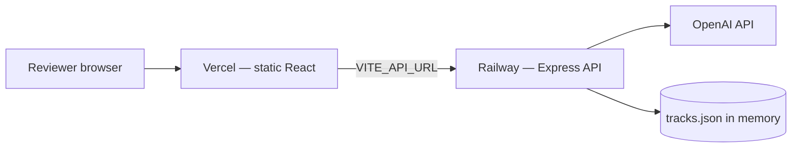

# Spotify Moment — Implementation Guide

> Step-by-step build guide for all phases in [architecture.md](./architecture.md).  
> **Order:** Scaffold → Phase 1 → Phase 2 → Phase 3 → Phase 4 → Phase 5 (Railway) → Phase 6 (Vercel).

---

## Table of Contents

1. [Prerequisites & project scaffold](#1-prerequisites--project-scaffold)
2. [Shared types & mock data](#2-shared-types--mock-data)
3. [Phase 0 — Server + client skeleton](#3-phase-0--server--client-skeleton)
4. [Phase 1 — Context Engine + LLM](#4-phase-1--context-engine--llm)
5. [Phase 2 — Discovery Slots](#5-phase-2--discovery-slots)
6. [Phase 3 — Repetition Fatigue](#6-phase-3--repetition-fatigue)
7. [UI design system (Figma)](#7-ui-design-system-figma)
8. [Phase 4 — Frontend UI showcase](#8-phase-4--frontend-ui-showcase)
9. [Phase 5 — Deploy backend on Railway](#9-phase-5--deploy-backend-on-railway)
10. [Phase 6 — Deploy frontend on Vercel](#10-phase-6--deploy-frontend-on-vercel)
11. [Environment & run commands](#11-environment--run-commands)
12. [API testing (curl)](#12-api-testing-curl)
13. [Troubleshooting](#13-troubleshooting)

---

## 1. Prerequisites & project scaffold

### Requirements

- Node.js 18+
- npm or pnpm
- LLM API key (OpenAI, Gemini, or Anthropic) — optional; fallback works without it

### Create project structure

```bash
mkdir spotify-moment && cd spotify-moment
mkdir -p server/data server/services server/routes
mkdir -p client/src/{api,hooks,components,types}
```

### Initialize packages

**Root `package.json`** (optional workspace) or two separate folders:

```bash
cd server && npm init -y
npm install express cors dotenv uuid
npm install -D typescript @types/express @types/cors @types/node tsx

cd ../client && npm create vite@latest . -- --template react-ts
npm install
npm install -D tailwindcss @tailwindcss/vite
```

### Root layout (target)

```
spotify-moment/
├── server/
│   ├── index.ts
│   ├── routes/session.routes.ts
│   ├── services/
│   │   ├── sessionEngine.ts
│   │   ├── llm.service.ts
│   │   └── sessionStore.ts
│   ├── types/session.types.ts
│   └── data/
│       ├── tracks.json
│       ├── taste.json
│       └── artist-adjacency.json
├── client/
│   └── src/ ...
└── .env                          # server only — never commit
```

---

## 2. Shared types & mock data

### `server/types/session.types.ts`

Copy these types on both server and client (`client/src/types/session.ts` — same shapes).

```typescript
export type SignalType =
  | 'PLAY'
  | 'SKIP'
  | 'LIKE'
  | 'SAVE'
  | 'REPLAY'
  | 'LISTEN_COMPLETE';

export interface Track {
  id: string;
  title: string;
  artist: string;
  albumArt?: string;
  energy: number;              // 1–5
  genres: string[];
  isMainstream: boolean;
  isDiscoveryCandidate: boolean;
  isFemaleArtist?: boolean;
  durationSec: number;
}

export interface SessionConstraints {
  minEnergy?: number;
  maxEnergy?: number;
  excludeGenres?: string[];
  includeGenres?: string[];
  lessMainstream?: boolean;
  preferFemaleArtists?: boolean;
  lockEnergyBand?: number;     // "keep this energy"
}

export interface RecommendationItem {
  id: string;
  title: string;
  artist: string;
  albumArt?: string;
  energy: number;
  isDiscovery: boolean;
  isSwap: boolean;
  reason: string;
}

export interface SessionState {
  sessionId: string;
  deviceType: string;
  contextLabel: string;
  contextConfidence: number;
  sessionEnergy: number;         // internal 1–5 bias
  explorationLevel: number;        // 0–1
  familiarityScore: number;        // 0–1
  sessionConstraints: SessionConstraints;
  recommendations: RecommendationItem[];
  nowPlaying: { trackId: string; progress: number } | null;
  artistPlayCounts: Record<string, number>;
  recentSignals: string[];
  toast?: string;
  insightBanner?: string;
  sessionMessage?: string;
  isAnalyzing: boolean;
  lastFatigueArtist?: string;
  pendingLlm: boolean;
}

export interface SessionResponse extends Omit<SessionState, 'sessionEnergy' | 'recentSignals' | 'pendingLlm' | 'lastFatigueArtist'> {}
```

### `server/data/taste.json`

Long-term taste — **never modified** at runtime.

```json
{
  "preferredGenres": ["pop", "indie-pop", "synth-pop"],
  "preferredArtists": ["Taylor Swift", "The Weeknd", "Dua Lipa"],
  "description": "Long-term taste profile (read-only)"
}
```

### `server/data/artist-adjacency.json`

Used in Phase 3 for swaps.

```json
{
  "Taylor Swift": ["Sabrina Carpenter", "Gracie Abrams"],
  "The Weeknd": ["The Kid LAROI", "Post Malone"],
  "Dua Lipa": ["Doja Cat", "Anne-Marie"]
}
```

### `server/data/tracks.json`

Minimum ~20 tracks. Example entries (add more following same pattern):

```json
[
  {
    "id": "t1",
    "title": "Anti-Hero",
    "artist": "Taylor Swift",
    "energy": 3,
    "genres": ["pop"],
    "isMainstream": true,
    "isDiscoveryCandidate": false,
    "isFemaleArtist": true,
    "durationSec": 200
  },
  {
    "id": "t2",
    "title": "Lavender Haze",
    "artist": "Taylor Swift",
    "energy": 4,
    "genres": ["pop"],
    "isMainstream": true,
    "isDiscoveryCandidate": false,
    "isFemaleArtist": true,
    "durationSec": 202
  },
  {
    "id": "t3",
    "title": "Slow Burn",
    "artist": "Unknown Acoustic",
    "energy": 1,
    "genres": ["acoustic"],
    "isMainstream": false,
    "isDiscoveryCandidate": false,
    "isFemaleArtist": true,
    "durationSec": 210
  },
  {
    "id": "t4",
    "title": "Midnight Run",
    "artist": "Pulse Runner",
    "energy": 5,
    "genres": ["synth-pop"],
    "isMainstream": false,
    "isDiscoveryCandidate": false,
    "isFemaleArtist": false,
    "durationSec": 195
  },
  {
    "id": "t5",
    "title": "Bass Drop Fever",
    "artist": "DJ Nova",
    "energy": 5,
    "genres": ["EDM"],
    "isMainstream": true,
    "isDiscoveryCandidate": false,
    "isFemaleArtist": false,
    "durationSec": 180
  },
  {
    "id": "d1",
    "title": "Espresso",
    "artist": "Sabrina Carpenter",
    "energy": 4,
    "genres": ["pop"],
    "isMainstream": true,
    "isDiscoveryCandidate": true,
    "isFemaleArtist": true,
    "durationSec": 175
  },
  {
    "id": "d2",
    "title": "Close to You",
    "artist": "Gracie Abrams",
    "energy": 2,
    "genres": ["indie-pop"],
    "isMainstream": false,
    "isDiscoveryCandidate": true,
    "isFemaleArtist": true,
    "durationSec": 220
  }
]
```

Add at least: 4 Taylor Swift tracks, 3 EDM tracks, 4 low-energy, 4 high-energy, 6 discovery candidates.

---

## 3. Phase 0 — Server + client skeleton

**Time:** ~40 min  
**Goal:** Server runs, client loads, `POST /api/session/start` returns a queue.

### Step 3.1 — `server/services/sessionStore.ts`

```typescript
import { v4 as uuid } from 'uuid';
import type { SessionState } from '../types/session.types.js';

const sessions = new Map<string, SessionState>();

export function createSession(deviceType = 'desktop'): SessionState {
  const session: SessionState = {
    sessionId: uuid(),
    deviceType,
    contextLabel: 'Starting session',
    contextConfidence: 40,
    sessionEnergy: 3,
    explorationLevel: 0.5,
    familiarityScore: 0.5,
    sessionConstraints: {},
    recommendations: [],
    nowPlaying: null,
    artistPlayCounts: {},
    recentSignals: [],
    isAnalyzing: false,
    pendingLlm: false,
  };
  sessions.set(session.sessionId, session);
  return session;
}

export function getSession(sessionId: string): SessionState | undefined {
  return sessions.get(sessionId);
}

export function getLatestSession(): SessionState | undefined {
  const all = [...sessions.values()];
  return all[all.length - 1];
}

export function updateSession(session: SessionState): void {
  sessions.set(session.sessionId, session);
}

export function toResponse(session: SessionState) {
  const { sessionEnergy, recentSignals, pendingLlm, lastFatigueArtist, ...rest } = session;
  return rest;
}
```

### Step 3.2 — `server/index.ts`

```typescript
import express from 'express';
import cors from 'cors';
import dotenv from 'dotenv';
import sessionRoutes from './routes/session.routes.js';

dotenv.config();

const app = express();
app.use(cors({ origin: 'http://localhost:5173' }));
app.use(express.json());

app.use('/api/session', sessionRoutes);

const PORT = process.env.PORT || 3001;
app.listen(PORT, () => console.log(`Server http://localhost:${PORT}`));
```

### Step 3.3 — `server/routes/session.routes.ts` (stub)

Wire routes; engine functions added in Phase 1.

```typescript
import { Router } from 'express';
import {
  createSession,
  getLatestSession,
  getSession,
  toResponse,
  updateSession,
} from '../services/sessionStore.js';
import { startSession, handleSignal, handleRefine } from '../services/sessionEngine.js';

const router = Router();

router.post('/start', async (req, res) => {
  const session = createSession(req.body?.deviceType ?? 'desktop');
  await startSession(session);
  updateSession(session);
  res.json(toResponse(session));
});

router.post('/signal', async (req, res) => {
  const session = getLatestSession();
  if (!session) return res.status(400).json({ error: 'No session. POST /start first.' });

  await handleSignal(session, {
    type: req.body.type,
    trackId: req.body.trackId,
    skipAtSec: req.body.skipAtSec ?? 0,
  });
  updateSession(session);
  res.json(toResponse(session));
});

router.post('/refine', async (req, res) => {
  const session = getLatestSession();
  if (!session) return res.status(400).json({ error: 'No session.' });

  await handleRefine(session, req.body.text ?? '');
  updateSession(session);
  res.json(toResponse(session));
});

router.get('/', (_req, res) => {
  const session = getLatestSession();
  if (!session) return res.status(404).json({ error: 'No session.' });
  res.json(toResponse(session));
});

export default router;
```

### Step 3.4 — `server/services/sessionEngine.ts` (stub)

```typescript
import type { SessionState, SignalType } from '../types/session.types.js';

export async function startSession(session: SessionState): Promise<void> {
  // Phase 1 implements fully
  session.contextLabel = getTimeBasedLabel();
  session.contextConfidence = 55;
}

export async function handleSignal(
  session: SessionState,
  payload: { type: SignalType; trackId?: string; skipAtSec?: number }
): Promise<void> {
  // Phase 1–3 implement
}

export async function handleRefine(session: SessionState, text: string): Promise<void> {
  // Phase 1 implements
}

function getTimeBasedLabel(): string {
  const h = new Date().getHours();
  if (h >= 5 && h < 11) return 'Morning Commute';
  if (h >= 11 && h < 17) return 'Afternoon Focus';
  if (h >= 17 && h < 22) return 'Evening Wind-down';
  return 'Late Night';
}
```

### Step 3.5 — Client stub

**`client/src/api/sessionClient.ts`**

```typescript
const BASE = 'http://localhost:3001/api/session';

export async function startSession(deviceType = 'desktop') {
  const res = await fetch(`${BASE}/start`, {
    method: 'POST',
    headers: { 'Content-Type': 'application/json' },
    body: JSON.stringify({ deviceType }),
  });
  return res.json();
}

export async function sendSignal(body: {
  type: string;
  trackId?: string;
  skipAtSec?: number;
}) {
  const res = await fetch(`${BASE}/signal`, {
    method: 'POST',
    headers: { 'Content-Type': 'application/json' },
    body: JSON.stringify(body),
  });
  return res.json();
}

export async function refineSession(text: string) {
  const res = await fetch(`${BASE}/refine`, {
    method: 'POST',
    headers: { 'Content-Type': 'application/json' },
    body: JSON.stringify({ text }),
  });
  return res.json();
}
```

**Phase 0 done when:** `npm run dev` on both; `POST /start` returns JSON with empty or placeholder recommendations.

---

## 4. Phase 1 — Context Engine + LLM

**Time:** ~60–90 min  
**Showcases:** Solution 1 — passive context + conversational refine.

### Step 4.1 — Load catalog helpers

Add to top of `sessionEngine.ts`:

```typescript
import tracks from '../data/tracks.json' assert { type: 'json' };
import taste from '../data/taste.json' assert { type: 'json' };
import type { Track, SessionState, RecommendationItem } from '../types/session.types.js';
import { analyzeSession } from './llm.service.js';

const TRACKS = tracks as Track[];
const TASTE = taste as { preferredGenres: string[]; preferredArtists: string[] };
```

> If JSON imports fail, use `readFileSync` + `JSON.parse` instead.

### Step 4.2 — Scoring & sort (core re-ranker)

```typescript
function scoreTrack(track: Track, session: SessionState): number {
  let score = 0;

  // Long-term taste (static)
  if (TASTE.preferredArtists.includes(track.artist)) score += 3;
  if (track.genres.some(g => TASTE.preferredGenres.includes(g))) score += 2;

  // Session energy match
  score -= Math.abs(track.energy - session.sessionEnergy) * 1.5;

  // Exploration bias (Phase 2 uses this more)
  if (track.isDiscoveryCandidate) {
    score += session.explorationLevel * 2;
  } else {
    score += (1 - session.explorationLevel) * 1.5;
  }

  // Session constraints (refine)
  const c = session.sessionConstraints;
  if (c.minEnergy && track.energy < c.minEnergy) score -= 10;
  if (c.maxEnergy && track.energy > c.maxEnergy) score -= 10;
  if (c.excludeGenres?.some(g => track.genres.includes(g))) score -= 20;
  if (c.lessMainstream && track.isMainstream) score -= 3;
  if (c.preferFemaleArtists && track.isFemaleArtist) score += 2;
  if (c.lockEnergyBand && Math.abs(track.energy - c.lockEnergyBand) <= 1) score += 3;

  // Boost recently liked artist/genre from signals
  const lastLike = [...session.recentSignals].reverse().find(s => s.startsWith('LIKE'));
  if (lastLike?.includes(track.artist)) score += 4;

  return score;
}

function buildQueue(session: SessionState): RecommendationItem[] {
  const sorted = [...TRACKS]
    .map(t => ({ track: t, score: scoreTrack(t, session) }))
    .sort((a, b) => b.score - a.score)
    .slice(0, 12)
    .map(({ track }) => ({
      id: track.id,
      title: track.title,
      artist: track.artist,
      energy: track.energy,
      isDiscovery: false,
      isSwap: false,
      reason: 'Matched to your listening taste.',
    }));

  return sorted;
}
```

### Step 4.3 — Signal handling

```typescript
export async function handleSignal(
  session: SessionState,
  payload: { type: SignalType; trackId?: string; skipAtSec?: number }
): Promise<void> {
  const track = TRACKS.find(t => t.id === payload.trackId);
  session.toast = undefined;
  session.insightBanner = undefined;

  switch (payload.type) {
    case 'SKIP': {
      const sec = payload.skipAtSec ?? 0;
      const dur = track?.durationSec ?? 200;
      if (sec < 15) {
        session.sessionEnergy = Math.min(5, session.sessionEnergy + 1);
        session.recentSignals.push(`SKIP@${sec}s early-low-tolerance`);
      } else if (sec > dur * 0.5) {
        session.sessionEnergy = Math.max(1, session.sessionEnergy - 1);
        session.recentSignals.push(`SKIP@${sec}s late-maybe-too-intense`);
      } else {
        session.recentSignals.push(`SKIP@${sec}s`);
      }
      break;
    }
    case 'LIKE':
    case 'SAVE':
      if (track) {
        session.recentSignals.push(`${payload.type} ${track.artist} ${track.genres[0]}`);
        session.artistPlayCounts[track.artist] = (session.artistPlayCounts[track.artist] ?? 0) + 1;
      }
      break;
    case 'REPLAY':
      if (track) session.recentSignals.push(`REPLAY energy-${track.energy}`);
      break;
    case 'PLAY':
      if (track) {
        session.nowPlaying = { trackId: track.id, progress: 0 };
        session.artistPlayCounts[track.artist] = (session.artistPlayCounts[track.artist] ?? 0) + 1;
        session.recentSignals.push(`PLAY ${track.title}`);
      }
      break;
    case 'LISTEN_COMPLETE':
      session.recentSignals.push('LISTEN_COMPLETE');
      break;
  }

  session.recentSignals = session.recentSignals.slice(-10);
  session.contextLabel = deriveRuleLabel(session);
  session.contextConfidence = Math.min(95, session.contextConfidence + 5);

  // Instant re-rank
  session.recommendations = buildQueue(session);

  // Phase 2 & 3 hooks (implemented next)
  applyDiscoverySlots(session);
  applyFatigueSwaps(session);

  // LLM enrichment
  await enrichWithLlm(session);
}
```

### Step 4.4 — Rule-based context label

```typescript
function deriveRuleLabel(session: SessionState): string {
  const base = getTimeBasedLabel();
  if (session.sessionEnergy >= 4) return 'High Energy Commute';
  if (session.sessionEnergy <= 2) return `${base} · Low Key`;
  return base;
}
```

### Step 4.5 — `server/services/llm.service.ts`

```typescript
import type { SessionState } from '../types/session.types.js';

const OPENAI_KEY = process.env.OPENAI_API_KEY;
const GEMINI_KEY = process.env.GEMINI_API_KEY;

export async function analyzeSession(
  session: SessionState,
  opts?: { refineText?: string; fatigueEvent?: string }
) {
  const payload = {
    recentSignals: session.recentSignals,
    timeOfDay: getTimeOfDay(),
    explorationLevel: session.explorationLevel,
    artistPlayCounts: session.artistPlayCounts,
    refineText: opts?.refineText,
    fatigueEvent: opts?.fatigueEvent,
    tracks: session.recommendations.slice(0, 10).map(r => ({
      id: r.id,
      title: r.title,
      artist: r.artist,
      energy: r.energy,
      isDiscovery: r.isDiscovery,
    })),
  };

  if (!OPENAI_KEY && !GEMINI_KEY) {
    return fallbackAnalysis(session, opts);
  }

  try {
    if (OPENAI_KEY) return await callOpenAI(payload);
    return await callGemini(payload);
  } catch (e) {
    console.warn('LLM failed, using fallback', e);
    return fallbackAnalysis(session, opts);
  }
}

async function callOpenAI(payload: unknown) {
  const res = await fetch('https://api.openai.com/v1/chat/completions', {
    method: 'POST',
    headers: {
      Authorization: `Bearer ${OPENAI_KEY}`,
      'Content-Type': 'application/json',
    },
    body: JSON.stringify({
      model: 'gpt-4o-mini',
      response_format: { type: 'json_object' },
      messages: [
        {
          role: 'system',
          content: `You are Spotify Moment session AI. Return JSON only.
Never modify long-term taste. Session scope only.
Keys: contextLabel, contextConfidence (0-100), sessionConstraints (optional),
explanations (object trackId->string), insightBanner (optional), sessionMessage (optional).`,
        },
        { role: 'user', content: JSON.stringify(payload) },
      ],
    }),
  });
  const data = await res.json();
  return JSON.parse(data.choices[0].message.content);
}

function fallbackAnalysis(session: SessionState, opts?: { refineText?: string; fatigueEvent?: string }) {
  const explanations: Record<string, string> = {};
  for (const r of session.recommendations) {
    if (r.isDiscovery) explanations[r.id] = 'Discovery pick — testing something adjacent to your vibe.';
    else if (session.recentSignals.some(s => s.includes('SKIP') && s.includes('early')))
      explanations[r.id] = 'Recommended because you skipped slower tracks this session.';
    else explanations[r.id] = 'Fits your current session mood.';
  }

  let sessionConstraints = session.sessionConstraints;
  let sessionMessage: string | undefined;

  if (opts?.refineText) {
    sessionConstraints = parseRefineKeywords(opts.refineText);
    sessionMessage = 'Applied to this session only.';
  }

  return {
    contextLabel: session.contextLabel,
    contextConfidence: session.contextConfidence,
    sessionConstraints,
    explanations,
    insightBanner: opts?.fatigueEvent,
    sessionMessage,
  };
}

export function parseRefineKeywords(text: string) {
  const t = text.toLowerCase();
  const c: Record<string, unknown> = {};
  if (t.includes('upbeat') || t.includes('energy')) c.minEnergy = 4;
  if (t.includes('not edm') || t.includes('no edm')) c.excludeGenres = ['EDM'];
  if (t.includes('less mainstream')) c.lessMainstream = true;
  if (t.includes('female')) c.preferFemaleArtists = true;
  if (t.includes('keep this energy') || t.includes('keep the energy')) c.lockEnergyBand = 4;
  return c;
}

function getTimeOfDay() {
  const h = new Date().getHours();
  if (h < 12) return 'morning';
  if (h < 17) return 'afternoon';
  if (h < 22) return 'evening';
  return 'night';
}

async function callGemini(payload: unknown) {
  // Optional: implement Gemini REST similarly
  return fallbackAnalysis({} as SessionState);
}
```

### Step 4.6 — LLM merge + debounce

```typescript
let llmTimer: ReturnType<typeof setTimeout> | null = null;

async function enrichWithLlm(session: SessionState, refineText?: string) {
  session.isAnalyzing = true;

  // Minimum analysis beat for demo UX
  const minDelay = new Promise(r => setTimeout(r, 800));

  const llmPromise = analyzeSession(session, { refineText });

  const [llm] = await Promise.all([llmPromise, minDelay]);

  if (llm.contextLabel) session.contextLabel = llm.contextLabel;
  if (llm.contextConfidence) session.contextConfidence = llm.contextConfidence;
  if (llm.sessionConstraints) session.sessionConstraints = { ...session.sessionConstraints, ...llm.sessionConstraints };
  if (llm.sessionMessage) session.sessionMessage = llm.sessionMessage;
  if (llm.insightBanner) session.insightBanner = llm.insightBanner;

  if (llm.explanations) {
    session.recommendations = session.recommendations.map(r => ({
      ...r,
      reason: llm.explanations[r.id] ?? r.reason,
    }));
  }

  session.isAnalyzing = false;
}

export async function startSession(session: SessionState): Promise<void> {
  session.contextLabel = getTimeBasedLabel();
  session.contextConfidence = 55;
  session.recommendations = buildQueue(session);
  await enrichWithLlm(session);
}

export async function handleRefine(session: SessionState, text: string): Promise<void> {
  session.sessionMessage = undefined;
  // Keyword pre-parse for instant effect even before LLM
  session.sessionConstraints = {
    ...session.sessionConstraints,
    ...parseRefineKeywords(text),
  };
  session.recommendations = buildQueue(session);
  applyDiscoverySlots(session);
  applyFatigueSwaps(session);
  await enrichWithLlm(session, text);
}
```

### Step 4.7 — Phase 1 verification

| Test | Expected |
|------|----------|
| `POST /start` | 12 recommendations, context label, reasons populated |
| `POST /signal` SKIP early on low-energy track | Queue shifts toward high energy |
| `POST /refine` "upbeat not edm" | EDM tracks drop; `sessionMessage` set |

---

## 5. Phase 2 — Discovery Slots

**Time:** ~30–45 min  
**Showcases:** Solution 2 — every 4th track is discovery; exploration meter.

### Step 5.1 — `applyDiscoverySlots` in `sessionEngine.ts`

```typescript
import tracks from '../data/tracks.json' assert { type: 'json' };

function applyDiscoverySlots(session: SessionState): void {
  const discoveryPool = (tracks as Track[]).filter(t => t.isDiscoveryCandidate);
  if (!discoveryPool.length) return;

  session.recommendations = session.recommendations.map((item, index) => {
    const slotIndex = index + 1;
    if (slotIndex % 4 !== 0) return { ...item, isDiscovery: false };

    // Pick best discovery candidate for this slot
    const replacement = pickDiscoveryTrack(session, discoveryPool, item);
    return {
      ...replacement,
      isDiscovery: true,
      isSwap: item.isSwap,
      reason: item.reason,
    };
  });
}

function pickDiscoveryTrack(
  session: SessionState,
  pool: Track[],
  current: RecommendationItem
): RecommendationItem {
  const existingIds = new Set(session.recommendations.map(r => r.id));
  const candidate = pool
    .filter(t => !existingIds.has(t.id))
    .sort((a, b) => scoreTrack(b, session) - scoreTrack(a, session))[0];

  if (!candidate) return current;

  return {
    id: candidate.id,
    title: candidate.title,
    artist: candidate.artist,
    energy: candidate.energy,
    isDiscovery: true,
    isSwap: false,
    reason: 'Discovery Track — exploring adjacent to your current vibe.',
  };
}
```

### Step 5.2 — Discovery feedback in `handleSignal`

Extend `handleSignal` after signal logging, before re-rank:

```typescript
function handleDiscoveryFeedback(
  session: SessionState,
  track: Track | undefined,
  type: SignalType,
  skipAtSec: number
): void {
  if (!track) return;
  const rec = session.recommendations.find(r => r.id === track.id);
  if (!rec?.isDiscovery) return;

  if (type === 'LIKE' || type === 'SAVE' || type === 'LISTEN_COMPLETE') {
    session.explorationLevel = Math.min(1, session.explorationLevel + 0.2);
    session.toast = 'Exploration Increased';
  } else if (type === 'SKIP' && skipAtSec < 15) {
    session.explorationLevel = Math.max(0, session.explorationLevel - 0.2);
    session.toast = 'Returning to familiar music';
  }
}
```

Call inside `handleSignal`:

```typescript
handleDiscoveryFeedback(session, track, payload.type, payload.skipAtSec ?? 0);
updateFamiliarityScore(session);
```

### Step 5.3 — Familiarity score helper

```typescript
function updateFamiliarityScore(session: SessionState): void {
  const repeatDensity = Object.values(session.artistPlayCounts).reduce((a, b) => a + b, 0);
  const repeatFactor = Math.min(1, repeatDensity / 10);
  session.familiarityScore = Math.max(
    0,
    Math.min(1, 1 - session.explorationLevel + repeatFactor * 0.3)
  );
}
```

### Step 5.4 — Phase 2 verification

| Test | Expected |
|------|----------|
| `GET /session` after start | Items 4, 8 have `isDiscovery: true` |
| LIKE on discovery track | `explorationLevel` ↑, toast set |
| Quick SKIP on discovery | `explorationLevel` ↓, toast set |

---

## 6. Phase 3 — Repetition Fatigue

**Time:** ~30–45 min  
**Showcases:** Solution 3 — artist repeat insight + adjacent swap.

### Step 6.1 — Load adjacency map

```typescript
import adjacency from '../data/artist-adjacency.json' assert { type: 'json' };
const ADJACENCY = adjacency as Record<string, string[]>;
```

### Step 6.2 — `applyFatigueSwaps`

```typescript
const FATIGUE_THRESHOLD = 3;

function applyFatigueSwaps(session: SessionState): void {
  for (const [artist, count] of Object.entries(session.artistPlayCounts)) {
    if (count < FATIGUE_THRESHOLD) continue;

    session.recommendations = session.recommendations.map(item => {
      if (item.artist !== artist) return item;

      const swapTrack = findAdjacentTrack(artist, session);
      if (!swapTrack) return item;

      session.lastFatigueArtist = artist;
      session.insightBanner =
        session.insightBanner ??
        `You've listened to ${artist} several times today. Trying something similar instead.`;

      return {
        id: swapTrack.id,
        title: swapTrack.title,
        artist: swapTrack.artist,
        energy: swapTrack.energy,
        isDiscovery: item.isDiscovery,
        isSwap: true,
        reason: `Similar to ${artist} — easing repetition.`,
      };
    });
  }
  updateFamiliarityScore(session);
}

function findAdjacentTrack(fatiguedArtist: string, session: SessionState): Track | undefined {
  const adjacentNames = ADJACENCY[fatiguedArtist] ?? [];
  const usedIds = new Set(session.recommendations.map(r => r.id));

  return (tracks as Track[]).find(
    t =>
      adjacentNames.includes(t.artist) &&
      !usedIds.has(t.id) &&
      t.artist !== fatiguedArtist
  );
}
```

### Step 6.3 — Optional LLM insight rewrite

After `applyFatigueSwaps`, if `session.insightBanner` was set, pass to LLM:

```typescript
if (session.lastFatigueArtist) {
  await enrichWithLlm(session, undefined /* fatigue handled via insightBanner in fallback */);
}
```

Or pass `fatigueEvent: session.insightBanner` into `analyzeSession`.

### Step 6.4 — Phase 3 verification

| Test | Expected |
|------|----------|
| PLAY/LIKE 3× same artist | `artistPlayCounts` ≥ 3 |
| Next queue build | Taylor Swift row → Sabrina Carpenter, `isSwap: true` |
| Response | `insightBanner` populated |

---

## 7. UI design system (Figma)

**Source kit:** [Spotify UI — Free UI Kit (Recreated)](https://www.figma.com/design/bbDRzBTD2MF2bqD1xfOg5Q/Spotify-UI---Free-UI-Kit--Recreated---Community-)

All Phase 4 styling must match this kit. Open these frames while building:

| Frame | Figma link | Build target |
|-------|------------|--------------|
| Home / Browse | [node 0-30](https://www.figma.com/design/bbDRzBTD2MF2bqD1xfOg5Q/Spotify-UI---Free-UI-Kit--Recreated---Community-?node-id=0-30) | Main `#121212` canvas, section headers |
| Sidebar | [node 0-372](https://www.figma.com/design/bbDRzBTD2MF2bqD1xfOg5Q/Spotify-UI---Free-UI-Kit--Recreated---Community-?node-id=0-372) | Left `#000000` panel — context, meters, refine |
| Now Playing | [node 0-1056](https://www.figma.com/design/bbDRzBTD2MF2bqD1xfOg5Q/Spotify-UI---Free-UI-Kit--Recreated---Community-?node-id=0-1056) | Player card — art, progress, controls |
| Queue / List | [node 0-1545](https://www.figma.com/design/bbDRzBTD2MF2bqD1xfOg5Q/Spotify-UI---Free-UI-Kit--Recreated---Community-?node-id=0-1545) | Track rows — hover, metadata, spacing |

### Step 7.0 — Create design tokens file

**`client/src/styles/tokens.css`**

```css
:root {
  /* Surfaces */
  --spotify-black: #000000;
  --spotify-bg: #121212;
  --spotify-surface: #181818;
  --spotify-surface-mid: #1f1f1f;
  --spotify-panel: #282828;
  --spotify-border: #333333;

  /* Brand */
  --spotify-green: #1ed760;
  --spotify-green-hover: #1abc54;
  --spotify-green-legacy: #1db954;
  --spotify-green-muted: rgba(29, 185, 84, 0.2);

  /* Text */
  --text-base: #ffffff;
  --text-subdued: #b3b3b3;
  --text-muted: #a7a7a7;
  --text-disabled: #535353;

  /* Moment-specific semantic */
  --accent-insight: #fcd34d;
  --accent-insight-bg: rgba(245, 158, 11, 0.12);
  --accent-insight-border: rgba(245, 158, 11, 0.35);
  --accent-swap: #f59e0b;
  --danger: #e91429;

  /* Layout */
  --sidebar-width: 240px;
  --radius-sm: 4px;
  --radius-md: 8px;
  --radius-lg: 12px;
  --radius-pill: 500px;
}

/* Typography — Circular fallback stack from kit */
body {
  font-family: "Circular", "Helvetica Neue", Helvetica, Arial, sans-serif;
  background: var(--spotify-bg);
  color: var(--text-base);
}
```

Import in **`client/src/index.css`:**

```css
@import "./styles/tokens.css";
```

### Design rules (from kit)

1. **Dark-first** — content glows on `#121212`; never use white backgrounds.
2. **Green = action** — `#1ed760` for primary buttons, active states, progress fill, discovery badges only.
3. **Three surface levels** — `#121212` page → `#181818` cards → `#282828` hover/interactive.
4. **Pill buttons** — `border-radius: 500px` for Skip, Like, Apply, toasts.
5. **Row hover** — track list items: transparent default, `#282828` on hover.
6. **Captions** — section labels: 11px, uppercase, `#b3b3b3`, letter-spacing `0.05em`.
7. **No custom fonts required** — Circular if installed locally; otherwise Helvetica Neue / system-ui.

### Tailwind mapping (optional)

If using Tailwind, extend `tailwind.config`:

```javascript
theme: {
  extend: {
    colors: {
      spotify: {
        black: '#000000',
        bg: '#121212',
        surface: '#181818',
        panel: '#282828',
        green: '#1ed760',
        'green-legacy': '#1db954',
      },
      subdued: '#b3b3b3',
      muted: '#a7a7a7',
    },
    borderRadius: {
      pill: '500px',
    },
  },
},
```

Or use CSS variables directly in components (current approach) — both are fine for MVP.

---

## 8. Phase 4 — Frontend UI showcase

**Time:** ~90–120 min  
**Build last** — backend Phases 1–3 must pass curl tests first.  
**Visual target:** Match Figma kit frames linked in [§7](#7-ui-design-system-figma).

### Step 8.1 — Global styles + layout shell

**`client/src/index.css`** — import tokens (see Step 7.0), then add layout:

```css
@import "./styles/tokens.css";

.app-shell {
  display: grid;
  grid-template-columns: var(--sidebar-width) 1fr;
  min-height: 100vh;
  background: var(--spotify-bg);
}

.sidebar {
  background: var(--spotify-black);
  padding: var(--space-3, 24px);
  border-right: 1px solid var(--spotify-border);
}

.main {
  padding: var(--space-3, 24px);
  overflow-y: auto;
}

.card {
  background: var(--spotify-surface);
  border-radius: var(--radius-md);
  padding: 16px 20px;
  margin-bottom: 16px;
}

.btn-primary {
  background: var(--spotify-green);
  color: #000;
  font-weight: 700;
  border: none;
  border-radius: var(--radius-pill);
  padding: 10px 24px;
  cursor: pointer;
}
.btn-primary:hover {
  background: var(--spotify-green-hover);
  transform: scale(1.04);
}

.btn-secondary {
  background: var(--spotify-panel);
  color: var(--text-base);
  border: none;
  border-radius: var(--radius-pill);
  padding: 8px 16px;
  cursor: pointer;
}
.btn-secondary:hover {
  background: #3e3e3e;
}
```

**`App.tsx` structure:**

```tsx
<div className="app-shell">
  <aside className="sidebar">{/* Context, meters, refine — Figma 0-372 */}</aside>
  <main className="main">
    {/* Player — Figma 0-1056 */}
    {/* Track list — Figma 0-1545 */}
  </main>
</div>
```

### Step 8.2 — `client/src/hooks/useSession.ts`

```typescript
import { useCallback, useEffect, useState } from 'react';
import * as api from '../api/sessionClient';
import type { SessionResponse } from '../types/session';

export function useSession() {
  const [state, setState] = useState<SessionResponse | null>(null);
  const [loading, setLoading] = useState(true);

  useEffect(() => {
    api.startSession().then(s => {
      setState(s);
      setLoading(false);
    });
  }, []);

  const refresh = useCallback(async (fn: () => Promise<SessionResponse>) => {
    const next = await fn();
    setState(next);
    return next;
  }, []);

  const skip = (trackId: string, skipAtSec = 8) =>
    refresh(() => api.sendSignal({ type: 'SKIP', trackId, skipAtSec }));

  const like = (trackId: string) =>
    refresh(() => api.sendSignal({ type: 'LIKE', trackId }));

  const save = (trackId: string) =>
    refresh(() => api.sendSignal({ type: 'SAVE', trackId }));

  const replay = (trackId: string) =>
    refresh(() => api.sendSignal({ type: 'REPLAY', trackId }));

  const play = (trackId: string) =>
    refresh(() => api.sendSignal({ type: 'PLAY', trackId }));

  const refine = (text: string) =>
    refresh(() => api.refineSession(text));

  return { state, loading, skip, like, save, replay, play, refine };
}
```

### Step 8.3 — Component implementations (Figma-aligned colours)

#### `ContextCard.tsx`

```tsx
interface Props {
  label: string;
  confidence: number;
  isAnalyzing: boolean;
}

export function ContextCard({ label, confidence, isAnalyzing }: Props) {
  return (
    <div className={`card ${isAnalyzing ? 'animate-pulse' : ''}`}>
      <p className="label">Current Context</p>
      <h2 className="context-title">{label}</h2>
      <p className="confidence">Confidence {confidence}%</p>
      <div className="bar">
        <div className="bar-fill" style={{ width: `${confidence}%` }} />
      </div>
    </div>
  );
}

/* CSS for ContextCard — use tokens.css variables */
.label {
  font-size: 11px;
  text-transform: uppercase;
  letter-spacing: 0.05em;
  color: var(--text-subdued);
}
.context-title {
  font-size: 20px;
  font-weight: 700;
  color: var(--text-base);
}
.bar { height: 4px; background: var(--spotify-border); border-radius: var(--radius-sm); }
.bar-fill { height: 100%; background: var(--spotify-green); border-radius: var(--radius-sm); transition: width 0.5s; }
```

#### `AnalysisOverlay.tsx`

```tsx
export function AnalysisOverlay({ show }: { show: boolean }) {
  if (!show) return null;
  return (
    <div className="overlay">
      <div className="overlay-card">
        <div className="spinner" />
        <p>AI is analysing your session</p>
      </div>
    </div>
  );
}

/* overlay: bg rgba(0,0,0,0.6); overlay-card: bg var(--spotify-panel); radius var(--radius-lg) */
/* spinner border: var(--spotify-green) */
```

#### `ExplorationMeter.tsx`

```tsx
export function ExplorationMeter({ level }: { level: number }) {
  const pct = Math.round(level * 100);
  return (
    <div className="mt-4">
      <div className="flex justify-between text-xs text-[#b3b3b3]">
        <span>Exploration</span>
        <span>{pct}%</span>
      </div>
      <div className="mt-1 h-2 rounded-full bg-[#333]">
        <div
          className="h-2 rounded-full bg-[#1db954] transition-all duration-700"
          style={{ width: `${pct}%` }}
        />
      </div>
    </div>
  );
}
```

#### `FamiliarityBar.tsx`

```tsx
export function FamiliarityBar({ score }: { score: number }) {
  // score 1 = familiar, 0 = discovery-leaning
  const discoveryPct = Math.round((1 - score) * 100);
  return (
    <div className="mt-3">
      <div className="flex justify-between text-xs">
        <span>Familiar</span>
        <span>Discovery</span>
      </div>
      <div className="relative mt-1 h-2 rounded-full bg-gradient-to-r from-[#535353] to-[#1db954]">
        <div
          className="absolute top-1/2 h-4 w-4 -translate-y-1/2 rounded-full bg-white shadow transition-all duration-700"
          style={{ left: `calc(${discoveryPct}% - 8px)` }}
        />
      </div>
    </div>
  );
}
```

#### `TrackList.tsx`

```tsx
import { DiscoveryBadge } from './DiscoveryBadge';

interface Track {
  id: string;
  title: string;
  artist: string;
  isDiscovery: boolean;
  isSwap: boolean;
  reason: string;
}

export function TrackList({
  tracks,
  onPlay,
}: {
  tracks: Track[];
  onPlay: (id: string) => void;
}) {
  return (
    <ul className="mt-4 space-y-2">
      {tracks.map((t, i) => (
        <li
          key={t.id}
          onClick={() => onPlay(t.id)}
          className={`cursor-pointer rounded-md p-3 transition-all duration-300 hover:bg-[#282828] ${
            t.isSwap ? 'ring-1 ring-amber-500/60 bg-amber-500/5' : 'bg-[#181818]'
          }`}
        >
          <div className="flex items-center gap-2">
            <span className="text-[#b3b3b3] w-6">{i + 1}</span>
            <div className="flex-1">
              <div className="flex items-center gap-2">
                <p className="font-medium">{t.title}</p>
                {t.isDiscovery && <DiscoveryBadge />}
              </div>
              <p className="text-sm text-[#b3b3b3]">{t.artist}</p>
              <p className="mt-1 text-xs text-[#727272]">{t.reason}</p>
            </div>
          </div>
        </li>
      ))}
    </ul>
  );
}
```

#### `DiscoveryBadge.tsx`

```tsx
export function DiscoveryBadge() {
  return (
    <span className="rounded-full bg-[#1db954]/20 px-2 py-0.5 text-xs text-[#1db954]">
      Discovery Track
    </span>
  );
}
```

#### `InsightBanner.tsx`

```tsx
export function InsightBanner({ message }: { message?: string }) {
  if (!message) return null;
  return (
    <div className="mt-3 rounded-md border border-amber-500/30 bg-amber-500/10 px-3 py-2 text-sm text-amber-200">
      {message}
    </div>
  );
}
```

#### `SessionToast.tsx`

```tsx
import { useEffect, useState } from 'react';

export function SessionToast({ message }: { message?: string }) {
  const [visible, setVisible] = useState(!!message);

  useEffect(() => {
    if (!message) return;
    setVisible(true);
    const t = setTimeout(() => setVisible(false), 3500);
    return () => clearTimeout(t);
  }, [message]);

  if (!visible || !message) return null;
  return (
    <div className="fixed bottom-6 left-1/2 z-40 -translate-x-1/2 rounded-full bg-[#282828] px-5 py-2 text-sm shadow-lg">
      {message}
    </div>
  );
}
```

#### `RefinePanel.tsx`

```tsx
import { useState } from 'react';

export function RefinePanel({
  onRefine,
  sessionMessage,
}: {
  onRefine: (text: string) => void;
  sessionMessage?: string;
}) {
  const [open, setOpen] = useState(false);
  const [text, setText] = useState('');

  return (
    <div className="mt-4">
      <button
        onClick={() => setOpen(!open)}
        className="text-sm text-[#b3b3b3] hover:text-white"
      >
        Refine this Session {open ? '▴' : '▾'}
      </button>
      {open && (
        <div className="mt-2 flex gap-2">
          <input
            className="flex-1 rounded-md bg-[#282828] px-3 py-2 text-sm outline-none focus:ring-1 focus:ring-[#1db954]"
            placeholder='e.g. "Something upbeat but not EDM"'
            value={text}
            onChange={e => setText(e.target.value)}
          />
          <button
            onClick={() => { onRefine(text); setText(''); }}
            className="rounded-full bg-[#1db954] px-4 py-2 text-sm font-medium text-black"
          >
            Apply
          </button>
        </div>
      )}
      {sessionMessage && (
        <p className="mt-2 text-sm text-[#1db954]">{sessionMessage}</p>
      )}
    </div>
  );
}
```

#### `PlayerBar.tsx`

```tsx
interface Props {
  track?: { id: string; title: string; artist: string };
  onSkip: () => void;
  onLike: () => void;
  onSave: () => void;
  onReplay: () => void;
}

export function PlayerBar({ track, onSkip, onLike, onSave, onReplay }: Props) {
  if (!track) return <div className="text-[#b3b3b3]">Select a track to play</div>;

  return (
    <div className="rounded-lg bg-[#181818] p-4">
      <p className="text-lg font-bold">{track.title}</p>
      <p className="text-[#b3b3b3]">{track.artist}</p>
      <div className="mt-3 h-1 rounded-full bg-[#535353]">
        <div className="h-1 w-1/3 rounded-full bg-[#1db954]" />
      </div>
      <div className="mt-4 flex gap-3">
        <button onClick={onReplay} title="Replay">↺</button>
        <button onClick={onSkip} title="Skip" className="text-xl">⏭</button>
        <button onClick={onLike} title="Like">♥</button>
        <button onClick={onSave} title="Save">💾</button>
      </div>
    </div>
  );
}
```

### Step 8.4 — `App.tsx` (compose everything)

```tsx
import { useMemo } from 'react';
import { useSession } from './hooks/useSession';
import { ContextCard } from './components/ContextCard';
import { AnalysisOverlay } from './components/AnalysisOverlay';
import { ExplorationMeter } from './components/ExplorationMeter';
import { FamiliarityBar } from './components/FamiliarityBar';
import { InsightBanner } from './components/InsightBanner';
import { RefinePanel } from './components/RefinePanel';
import { SessionToast } from './components/SessionToast';
import { TrackList } from './components/TrackList';
import { PlayerBar } from './components/PlayerBar';

export default function App() {
  const { state, loading, skip, like, save, replay, play, refine } = useSession();

  const nowPlaying = useMemo(() => {
    if (!state?.nowPlaying) return state?.recommendations[0];
    return state.recommendations.find(r => r.id === state.nowPlaying?.trackId)
      ?? state.recommendations[0];
  }, [state]);

  if (loading || !state) return <div className="p-8">Loading…</div>;

  const currentId = nowPlaying?.id ?? '';

  return (
    <div className="min-h-screen p-6">
      <AnalysisOverlay show={state.isAnalyzing} />
      <SessionToast message={state.toast} />

      <header className="mb-6 flex justify-between">
        <h1 className="text-2xl font-bold">Spotify Moment</h1>
        <span className="rounded-full bg-[#282828] px-3 py-1 text-xs">{state.deviceType}</span>
      </header>

      <div className="grid gap-6 lg:grid-cols-2">
        <aside>
          <ContextCard
            label={state.contextLabel}
            confidence={state.contextConfidence}
            isAnalyzing={state.isAnalyzing}
          />
          <ExplorationMeter level={state.explorationLevel} />
          <FamiliarityBar score={state.familiarityScore} />
          <InsightBanner message={state.insightBanner} />
          <RefinePanel onRefine={refine} sessionMessage={state.sessionMessage} />
        </aside>

        <main>
          <PlayerBar
            track={nowPlaying}
            onSkip={() => skip(currentId, 8)}
            onLike={() => like(currentId)}
            onSave={() => save(currentId)}
            onReplay={() => replay(currentId)}
          />
          <h3 className="mt-6 text-sm uppercase text-[#b3b3b3]">For You · updates live</h3>
          <TrackList tracks={state.recommendations} onPlay={play} />
        </main>
      </div>
    </div>
  );
}
```

### Step 8.5 — Phase 4 polish checklist

- [ ] Colours match Figma kit: `#121212` bg, `#181818` cards, `#1ed760` accents, `#b3b3b3` secondary text
- [ ] Sidebar `#000000` + main content split (frames 0-372 + 0-30)
- [ ] Player matches frame 0-1056 (art placeholder, green progress, pill controls)
- [ ] Track list matches frame 0-1545 (row hover `#282828`, reason text `#535353`)
- [ ] List animates on update (`transition` 300ms on rows)
- [ ] Analysis overlay shows min 800ms
- [ ] Discovery badge: green pill on every 4th row
- [ ] Swap rows: amber highlight (`--accent-swap`)
- [ ] Refine success: green `#1ed760` session-only message
- [ ] Toast: `#282828` pill, bottom centre
- [ ] Run full [demo script](./architecture.md#reviewer-demo-script-5-min)

---

## 9. Phase 5 — Deploy backend on Railway

**Time:** ~20–30 min  
**Goal:** Express API live on a public HTTPS URL; health check passes; CORS allows your Vercel frontend.

**Deploy backend first** — the frontend needs `VITE_API_URL` pointing at your Railway URL.

### Step 9.1 — Prep the server for production

Railway injects `PORT` automatically. The server binds `0.0.0.0` and uses `process.env.PORT`.

**`server/index.ts`** — listen on all interfaces (required for containers):

```typescript
const PORT = Number(process.env.PORT) || 3001;
const HOST = process.env.HOST ?? '0.0.0.0';

app.listen(PORT, HOST, () => {
  console.log(`Server listening on ${HOST}:${PORT}`);
});
```

**`server/package.json`** — `tsx` is a **production** dependency (Railway runs `npm start`):

```json
{
  "engines": { "node": ">=20" },
  "scripts": {
    "dev": "tsx watch index.ts",
    "start": "tsx index.ts"
  },
  "dependencies": {
    "tsx": "^4.19.3"
  }
}
```

**`server/railway.json`** — config-as-code (health check + watch paths):

```json
{
  "$schema": "https://railway.com/railway.schema.json",
  "build": {
    "watchPatterns": ["spotify-moment/server/**"]
  },
  "deploy": {
    "startCommand": "npm start",
    "healthcheckPath": "/api/health",
    "healthcheckTimeout": 120,
    "restartPolicyType": "ON_FAILURE"
  }
}
```

> **Note:** In-memory sessions reset when Railway redeploys or restarts. Fine for MVP demos.

### Step 9.2 — Push to GitHub

Railway deploys from Git. Ensure `server/.env` is **not** committed.

```bash
git add .
git commit -m "Add Railway deployment config"
git push origin main
```

### Step 9.3 — Create Railway service

1. Go to [railway.app](https://railway.app) → **New Project** → **Deploy from GitHub repo**.
2. Select [Spotify-Moments-MVP](https://github.com/tejas2904-RM/Spotify-Moments-MVP).
3. Open the new service → **Settings**:

| Setting | Value |
|---------|-------|
| **Root Directory** | `spotify-moment/server` |
| **Config file path** | `/spotify-moment/server/railway.json` (if not auto-detected) |
| **Start Command** | `npm start` (set in `railway.json` or leave to Nixpacks/Railpack) |

4. **Variables** tab → add:

| Key | Value |
|-----|-------|
| `OPENAI_API_KEY` | Your OpenAI key (optional; keyword fallback works without it) |
| `CLIENT_URL` | Leave blank for now; set after Vercel deploy (Step 10.4) |

5. **Settings → Networking → Generate Domain** to get a public URL like `https://spotify-moment-api.up.railway.app`.

6. Wait for deploy to succeed (green health check on `/api/health`).

### Step 9.4 — Verify backend

Replace `YOUR-SERVICE` with your Railway domain:

```bash
curl https://YOUR-SERVICE.up.railway.app/api/health
# → {"ok":true,"service":"spotify-moment"}

curl -X POST https://YOUR-SERVICE.up.railway.app/api/session/start \
  -H "Content-Type: application/json" \
  -d '{"deviceType":"desktop"}'
# → JSON with recommendations array
```

**Save this URL** for Phase 6:

```
https://YOUR-SERVICE.up.railway.app
```

### Step 9.5 — Phase 5 verification

| Test | Expected |
|------|----------|
| `GET /api/health` | `200`, `{ ok: true }` |
| `POST /api/session/start` | `200`, 12 recommendations |
| Railway logs | `Server listening on 0.0.0.0:PORT` |
| Deploy | Health check passes within 120s |

---

## 10. Phase 6 — Deploy frontend on Vercel

**Time:** ~20–30 min  
**Goal:** React app on a public URL; API calls hit your Railway backend.

### Step 10.1 — Prep the client for production

**`client/src/api/sessionClient.ts`**

```typescript
const API_ROOT = (import.meta.env.VITE_API_URL ?? '').replace(/\/$/, '');
const BASE = `${API_ROOT}/api/session`;
```

- **Local dev:** `VITE_API_URL` unset → requests go to `/api/session` → Vite proxy → `localhost:3001`.
- **Production:** `VITE_API_URL=https://YOUR-SERVICE.up.railway.app` → full URL to Railway.

**`client/.env.example`**

```env
# VITE_API_URL=https://spotify-moment-api.up.railway.app
```

**`client/vercel.json`** — SPA fallback (React Router / client-side routes):

```json
{
  "rewrites": [{ "source": "/(.*)", "destination": "/index.html" }]
}
```

### Step 10.2 — Create Vercel project

1. Go to [vercel.com](https://vercel.com) → **Add New** → **Project**.
2. Import the same GitHub repo.
3. Configure:

| Setting | Value |
|---------|-------|
| **Framework Preset** | Vite |
| **Root Directory** | `spotify-moment/client` (or `client`) |
| **Build Command** | `npm run build` |
| **Output Directory** | `dist` |
| **Install Command** | `npm install` |

4. **Environment variables** (Production + Preview):

| Key | Value |
|-----|-------|
| `VITE_API_URL` | `https://YOUR-SERVICE.up.railway.app` (no trailing slash) |

5. Deploy.

### Step 10.3 — Verify frontend

1. Open your Vercel URL (e.g. `https://spotify-moment.vercel.app`).
2. App should load and show a track queue (not "connection error").
3. Open browser DevTools → Network → confirm requests go to `https://YOUR-SERVICE.up.railway.app/api/session/start`.

### Step 10.4 — Wire CORS (Railway ← Vercel)

Back in **Railway** → your service → **Variables**:

| Key | Value |
|-----|-------|
| `CLIENT_URL` | `https://your-app.vercel.app` |

Add preview URLs if needed (comma-separated):

```
https://spotify-moment.vercel.app,https://spotify-moment-git-main-you.vercel.app
```

Railway redeploys automatically. The server also allows any `https://*.vercel.app` origin for preview deployments.

### Step 10.5 — End-to-end demo checklist

- [ ] Context card loads with time-based label
- [ ] Skip / Like updates queue (no CORS errors in console)
- [ ] Refine panel works
- [ ] Discovery badge on 4th track
- [ ] Analysis overlay appears on signal
- [ ] Share **Vercel URL** with reviewers (not the Railway API URL)

### Step 10.6 — Phase 6 verification

| Test | Expected |
|------|----------|
| Vercel homepage | Loads UI, not blank / error screen |
| Network tab | `POST` to Railway `/api/session/start` → `200` |
| CORS | No `Access-Control-Allow-Origin` errors |
| Preview deploy | Works if `*.vercel.app` allowed or listed in `CLIENT_URL` |

### Deployment architecture



| Layer | Host | URL pattern |
|-------|------|-------------|
| Frontend | Vercel | `https://*.vercel.app` |
| Backend | Railway | `https://*.up.railway.app` |
| LLM key | Railway env only | Never in Vercel |

---

## 11. Environment & run commands

### `server/.env`

```env
PORT=3001
OPENAI_API_KEY=sk-...
# OR
GEMINI_API_KEY=...
```

### `server/package.json` scripts

```json
{
  "scripts": {
    "dev": "tsx watch index.ts",
    "start": "tsx index.ts"
  }
}
```

### `server/tsconfig.json`

```json
{
  "compilerOptions": {
    "target": "ES2022",
    "module": "NodeNext",
    "moduleResolution": "NodeNext",
    "strict": true,
    "esModuleInterop": true,
    "resolveJsonModule": true,
    "outDir": "dist"
  },
  "include": ["**/*.ts"]
}
```

### Run locally

```bash
# Terminal 1
cd server && npm run dev

# Terminal 2
cd client && npm run dev
```

Open `http://localhost:5173`.

---

## 12. API testing (curl)

Test backend **before** building UI.

```bash
# Start session
curl -s -X POST http://localhost:3001/api/session/start \
  -H "Content-Type: application/json" \
  -d '{"deviceType":"mobile"}' | jq '.contextLabel, .recommendations | length'

# Skip (early) — use a low-energy track id from your JSON
curl -s -X POST http://localhost:3001/api/session/signal \
  -H "Content-Type: application/json" \
  -d '{"type":"SKIP","trackId":"t3","skipAtSec":8}' | jq '.contextLabel, .recommendations[0]'

# Refine
curl -s -X POST http://localhost:3001/api/session/refine \
  -H "Content-Type: application/json" \
  -d '{"text":"Something upbeat but not EDM"}' | jq '.sessionMessage, .recommendations[].title'

# Discovery — like 4th track
curl -s -X POST http://localhost:3001/api/session/signal \
  -H "Content-Type: application/json" \
  -d '{"type":"LIKE","trackId":"<4th-track-id>"}' | jq '.explorationLevel, .toast'

# Fatigue — play same artist 3x
for i in 1 2 3; do
  curl -s -X POST http://localhost:3001/api/session/signal \
    -H "Content-Type: application/json" \
    -d '{"type":"LIKE","trackId":"t1"}' > /dev/null
done
curl -s http://localhost:3001/api/session | jq '.insightBanner, .recommendations[] | select(.isSwap)'
```

---

## 13. Troubleshooting

| Issue | Fix |
|-------|-----|
| CORS error | Ensure `CLIENT_URL` is set on Railway; `*.vercel.app` is allowed by default |
| CORS error on Vercel | `VITE_API_URL` must be Railway HTTPS URL; redeploy Vercel after env change |
| Frontend shows connection error | Backend not running locally, or `VITE_API_URL` wrong / missing on Vercel |
| Railway deploy fails | Set **Root Directory** to `spotify-moment/server`; check logs for missing `tsx` |
| Session resets on refresh | In-memory store — expected for MVP |
| `VITE_API_URL` not applied | Vite bakes env at build time — redeploy Vercel after changing the variable |
| LLM returns invalid JSON | Use `response_format: json_object` (OpenAI) or tighten system prompt |
| No API key | Fallback keywords still work for refine; template reasons used |
| Discovery slot not on 4th item | Check `applyDiscoverySlots` runs **after** `buildQueue` |
| Fatigue never triggers | Need 3+ `artistPlayCounts` for same artist; add more TS tracks in JSON |
| `isAnalyzing` stuck true | Wrap `enrichWithLlm` in try/finally; always set `false` in `finally` |
| JSON import errors in Node | Switch to `readFileSync(join(__dirname, '../data/tracks.json'))` |

---

## Phase completion summary

| Phase | Key files | Verify with |
|-------|-----------|-------------|
| **0** | `index.ts`, `session.routes.ts`, `sessionStore.ts` | `POST /start` returns 200 |
| **1** | `sessionEngine.ts`, `llm.service.ts` | curl skip + refine |
| **2** | `applyDiscoverySlots`, discovery feedback | 4th item `isDiscovery`; toast on like |
| **3** | `applyFatigueSwaps`, `artist-adjacency.json` | insight banner + `isSwap` |
| **4** | All `client/src/components/*`, `App.tsx` | 5-min demo script |
| **5** | `server/railway.json`, CORS, Railway env vars | `curl` health + `/start` on Railway URL |
| **6** | `sessionClient.ts`, `vercel.json`, `VITE_API_URL` | Vercel URL loads queue; no CORS errors |

---

*Implementation guide — follow phases in order. Backend first, UI last, deploy backend before frontend.*
